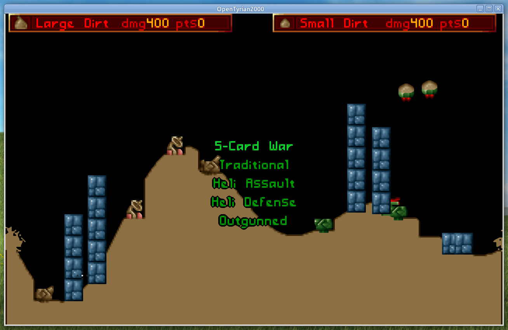

# Destruct

Standalone destruct minigame from Tyrian 2000 (https://tyrian.fandom.com/wiki/Destruct).




## Usage

### Installation
```bash
git clone https://github.com/mm318/destruct.git
```

### Build
All commands should be run from the newly downloaded `destruct` directory.

To build:
```bash
zig build                           # for debug build
zig build -Doptimize=ReleaseSafe    # for release build (recommended)
```

For convenience, to run:
```bash
zig build -Doptimize=ReleaseSafe run
```

### Develop

To format the source code:
```bash
zig fmt .
```


## Requirements

Tested on Ubuntu 20.04 using zig 0.14.0-dev.1911+3bf89f55c.
